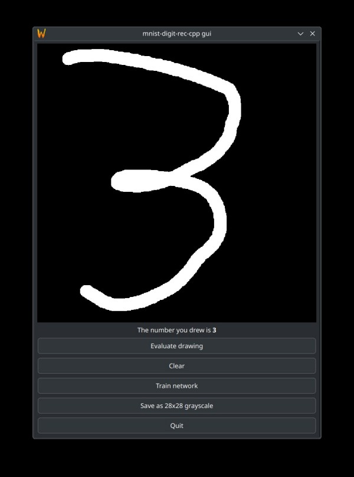

# mnist-digit-rec-cpp

**Work in progress**

Implementation of the classic neural network that recognises handwritten digits, trained on the
MNIST dataset in C++23 avoiding external dependencies as much as possible. For personal research and
learning, both theoretical and programming aspects.

Training and test data are located in the `/data` directory.

Matrix multiplication uses AVX512 or AVX2 on CPUs that support it.

## Required to build (so far):
- C++23 with standard library supporting parallel execution (requires `tbb` for `libstdc++`)
- `doctest` unit testing library
- Qt6 with the `Core, Widgets` modules for the GUI

## Building
- To train the network and evaluate accuracy on the test set use the `cli` target: 
  ```
  meson setup builddir-rel --buildtype=release -Db_ndebug=true && cd builddir-rel && meson compile cli && ./cli
  ```
- For the Qt6 interface use the `gui` target and run `./gui`, replacing appropriately in the
  previous line
- For testing use the `tests` target: `meson setup builddir && cd builddir && meson compile tests`
  and run `./tests`
- For release build: `meson setup builddir-rel --buildtype=release -Db_ndebug=true`

## Screenshots

